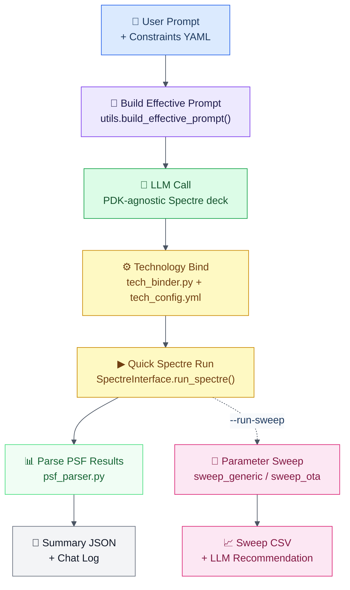

# LaMDA-Analog

**Language Model-Assisted Electronic Design Automation for Analog Circuit Design**

LaMDA-Analog is an automated framework that leverages Large Language Models (LLMs) to generate, simulate, and optionally sweep analog circuit designs from natural language descriptions. The tool integrates LLM-based Spectre netlist generation with local technology binding and Cadence Virtuoso Spectre simulation to create a complete end-to-end pipeline for analog design and evaluation.

---

## 🎯 Overview

LaMDA-Analog addresses the challenge of analog circuit design automation by combining the natural language understanding capabilities of modern LLMs with the precision of industry-standard simulation tools. The framework automatically:

1. **Reads** a user prompt and design constraints from `Evaluation/<Design>/user_prompt.txt` and `constraints.yml`
2. **Builds** an effective prompt by appending machine-readable constraint bullets to the base prompt
3. **Generates** a PDK-agnostic Spectre netlist via the LLM
4. **Binds** the netlist to a local technology using `config/tech_config.yml`
5. **Simulates** the bound netlist with a quick Spectre sanity run
6. **Parses** PSF results and writes a summary JSON with extracted metrics
7. **Optionally sweeps** device parameters using LLM-proposed sizing points and collects a sweep CSV

The current implementation targets two topologies: **CMOS inverter** and **5-transistor operational transconductance amplifier (OTA)**.

For OTA, the repository also includes an **ablation-study workflow** that runs controlled prompt/binding variants across models and summarizes outcomes with explicit simulation-attempt and simulation-pass reporting.

---

## 🚀 Installation

### Prerequisites

- **Python**: 3.9 or higher
- **Cadence Virtuoso Spectre**: available in `PATH` or via `SPECTRE_PATH`
- **Operating System**: Linux (tested on Rocky Linux 9)
- **API Keys**: OpenAI, Google Gemini, and/or OpenRouter (for DeepSeek and other OpenRouter models)

### Step 1: Access the Repository

```bash
cd LaMDA-Analog
```

### Step 2: Set Up Python Environment

```bash
# Create virtual environment, install dependencies, and activate it
source activate.sh

# Or manually:
python3 -m venv venv
source venv/bin/activate
pip install -r requirements.txt
```

### Step 3: Configure Environment Variables

Export variables or add them to a `.env` file:

```bash
# LLM API Keys (choose one or more)
export OPENAI_API_KEY="your-openai-api-key-here"
export GEMINI_API_KEY="your-gemini-api-key-here"
export OPENROUTER_API_KEY="your-openrouter-api-key-here"

# Optional provider override (openai, gemini, openrouter)
export LLM_PROVIDER="openrouter"

# Optional OpenRouter endpoint override
export LLM_BASE_URL="https://openrouter.ai/api/v1"

# Optional: any non-gpt/o-/gemini-* model name will route to OpenRouter when OPENROUTER_API_KEY is set
# Example: MODEL=llama-4-maverick
```

### Step 4: Configure Local Technology

```bash
# Edit config/tech_config.example.yml to point to your local PDK includes and model files
```

### Step 5: Verify Installation

```bash
# Check Python dependencies
python3 -c "import openai, pandas, matplotlib, yaml; print('Dependencies OK')"

# Check environment variables and Spectre path
make check_env
```

---

## 🔨 Makefile Automation

LaMDA-Analog provides Makefile automation at multiple levels.

### Root Makefile (Environment Setup)

Located at the project root.

| Target | Description | Usage |
|--------|-------------|-------|
| `check_env` | Verify environment variables are set | `make check_env` |
| `freeze_deps` | Save current dependencies to requirements.txt | `make freeze_deps` |
| `clean_env` | Remove virtual environment | `make clean_env` |
| `help_root` | Display help message | `make help_root` |

```bash
# First-time setup
source activate.sh

# Check environment
make check_env

# Update requirements.txt after installing new packages
make freeze_deps
```

**Parameters:**

- `PYTHON` — Python executable (default: `python3`)
- `VENV_DIR` — Virtual environment directory (default: `venv`)
- `REQ_FILE` — Requirements file (default: `requirements.txt`)

---

### Inverter Evaluation Makefile

Located in `Evaluation/Inverter/`.

| Target | Description | Usage |
|--------|-------------|-------|
| `run` | Run the inverter pipeline | `make MODEL=gpt-4o-mini run` |
| `clean_outputs` | Remove generated runs | `make clean_outputs` |
| `help` | Display help message | `make help` |

```bash
cd Evaluation/Inverter

# Run with default model (gpt-4o-mini)
make run

# Run with a specific model
make MODEL=gpt-4o MAX_TOKENS=4000 run

# Run with DeepSeek via OpenRouter
make MODEL=deepseek/deepseek-chat run
```

---

### OTA Evaluation Makefile

Located in `Evaluation/OTA/`.

| Target | Description | Usage |
|--------|-------------|-------|
| `run` | Run the OTA pipeline | `make MODEL=gpt-4o-mini run` |
| `clean_outputs` | Remove generated runs | `make clean_outputs` |
| `help` | Display help message | `make help` |

```bash
cd Evaluation/OTA

# Run with default model
make run

# Run with a specific model and temperature
make MODEL=gpt-4o TEMPERATURE=0.8 run

# Run with DeepSeek via OpenRouter
make MODEL=deepseek/deepseek-chat TEMPERATURE=0.8 run
```

**Common Parameters (both designs):**

- `MODEL` — LLM model name (default: `gpt-4o-mini`)
- `MAX_TOKENS` — Maximum tokens for generation (default: `3000`)
- `TEMPERATURE` — Sampling temperature (default: `1.0`)
- `TOP_P` — Top-p sampling parameter (default: `1.0`)
- `TECH_CFG` — Path to tech config file (default: `config/tech_config.yml`)

---

## 🖥 Shell Runner

`run_analog.sh` is the top-level entrypoint and accepts the same parameters as the Makefiles.

### Inverter flow

```bash
bash run_analog.sh --design inverter --model gpt-4o-mini
```

### OTA flow

```bash
bash run_analog.sh --design ota --model gpt-4o-mini
```

### With optional parameter sweep

```bash
bash run_analog.sh --design inverter --run-sweep
bash run_analog.sh --design ota --run-sweep
```

### All options

```bash
bash run_analog.sh \
  --design inverter \
  --model gpt-4o \
  --max_tokens 4000 \
  --temperature 0.8 \
  --top_p 0.95 \
  --tech_cfg config/tech_config.yml \
  --run-sweep
```

---

## 🧪 OTA Ablation Workflow

For OTA-only campaign experiments, use the dedicated runner:

```bash
./run_analog_ablation.sh --tag ota_ablation_v1
```

This script executes model x case x repeat combinations and writes:

- `Evaluation/OTA/ota_results_YYYYMMDD/gen_runs/...`
- `Evaluation/OTA/ota_results_YYYYMMDD/ablation_manifest.csv`

Case dimensions:

- `PromptPackage`: ON/OFF (system prompt + YAML constraints append)
- `TechBinding`: ON/OFF
- `UserPromptVariant`: normal/vague

Case IDs are `C0..C7` for full 8-case matrix.

See `Evaluation/OTA/ABLATION_SUMMARY.md` for exact case definitions.

---

## 📈 OTA Summarization

Run the manifest-aware summarizer:

```bash
python Evaluation/OTA/summarize_gen_runs.py
```

Typical explicit output command:

```bash
python Evaluation/OTA/summarize_gen_runs.py \
  --root . \
  --out_csv Evaluation/OTA/ota_results_20260916/LaMDA_Analog_exp_data_gen_runs.csv \
  --out_summary_csv Evaluation/OTA/ota_results_20260916/LaMDA_Analog_exp_summary.csv
```

Windows/PowerShell note: quote paths containing spaces.

The summarizer:

- Uses `ablation_manifest.csv` as source of planned runs.
- Includes failed/missing-summary runs in output.
- Computes spec pass/fail from `summary_ota.json` metrics when available.
- Splits simulation state into:
  - `Netlist simulated?`: Spectre was invoked (attempted)
  - `Simulation passed?`: Spectre log indicates clean completion

Summary CSV columns include:

- `Summary found rate (% of runs)`
- `Simulation attempted rate (%)`
- `Simulation pass rate (% of attempted)`

---

## 🧩 Merged Gain-Only Ablation Dataset

To build the merged gain-only OTA dataset used for cross-date ablation analysis:

```bash
python Evaluation/OTA/build_full_ablation_gain_only.py
```

This creates:

- `Evaluation/OTA/ota_results_20260916/LaMDA_Analog_exp_data_gen_runs_full_ablation_gain_only.csv`

Build rule:

- Structure follows `LaMDA_Analog_exp_data_gen_runs.csv`.
- `C0` and `C4` are replaced from `Evaluation/OTA/ota_results_20260819/LLM_Comparisons_OTA.csv`.
- Other cases (`C1,C2,C3,C5,C6,C7`) come from 20260916 run data.
- For legacy rows, empty `Result` is interpreted as simulation not passed.

---

## 📊 Design Flow



---

## 📁 Project Structure

```text
LaMDA-Analog/
├── activate.sh                       # Creates/activates venv and installs dependencies
├── Makefile                          # Root automation for environment checks and maintenance
├── requirements.txt                  # Python dependencies
├── utils.py                          # Shared utilities (prompt loaders, constraint builder)
├── run_analog.sh                     # Top-level shell entrypoint
│
├── config/
│   └── tech_config.example.yml       # Technology config template (PDK paths, model files)
│
├── EDA_Interface/
│   ├── Spectre.py                    # Spectre interface class (run, bind, sanitize, parse)
│   ├── psf_parser.py                 # PSF ASCII results parser
│   ├── psf_parser_ota.py             # OTA-specific AC/DC PSF parser
│   ├── psf_ac_parser.py              # Generic AC PSF parser
│   ├── tech_binder.py                # Technology binding from YAML config
│   ├── sanitize_inverter_netlist.py  # Inverter netlist cleanup
│   ├── sweep_generic.py              # Inverter parameter sweep runner
│   ├── sweep_ota.py                  # OTA bias sweep runner
│   ├── report_parser.py              # Sweep CSV to LLM-readable JSON
│   └── show_chat.py                  # Chat log renderer
│
├── LLM_Interface/
│   ├── LLMClient.py                  # LLM provider abstraction (OpenAI, Gemini)
│   ├── build_prompt.py               # CLI prompt builder from constraints YAML
│   ├── llm_generate_scs.py           # Standalone Spectre deck generation script
│   ├── llm_propose_sweep_points.py   # LLM-based sizing point proposal
│   └── llm_recommend.py              # LLM-based sweep recommendation
│
└── Evaluation/
    ├── Inverter/                      # Inverter topology
    │   ├── Run.py                     # InverterPipeline class (end-to-end flow)
    │   ├── Makefile                   # Inverter runner
    │   ├── constraints.yml            # Design constraints and LLM guidance
    │   ├── user_prompt.txt            # Base user prompt
    │   ├── system_prompt.md           # System prompt for inverter netlist generation
    │   ├── example_prompt.txt         # Example prompt for reference
    │   └── output/                    # Generated runs and sweep results (gitignored)
    └── OTA/                           # 5T OTA topology
        ├── Run.py                     # OTAPipeline class (end-to-end flow)
        ├── Makefile                   # OTA runner
      ├── summarize_gen_runs.py      # Manifest-aware OTA ablation summarizer
      ├── build_full_ablation_gain_only.py  # Gain-only merged ablation dataset builder
      ├── ABLATION_SUMMARY.md        # OTA ablation case definitions and semantics
        ├── constraints.yml            # Design constraints and LLM guidance
        ├── user_prompt.txt            # Base user prompt
      ├── user_prompt_vague.txt      # Alternate vague user prompt for ablation
        ├── system_prompt.md           # System prompt for OTA netlist generation
      ├── system_prompt_empty.md     # Empty system prompt artifact (PromptPackage OFF)
        ├── example_prompt.txt         # Example prompt for reference
        └── output/                    # Generated runs and sweep results (gitignored)
```

---

## 📂 Outputs

All artifacts are written under `Evaluation/<Design>/output/`:

| Path | Contents |
|------|----------|
| `output/gen_runs/<RUN_ID>/llm_raw_<RUN_ID>.scs` | Raw PDK-agnostic deck from LLM |
| `output/gen_runs/<RUN_ID>/inverter_netlist_<RUN_ID>.scs` | Technology-bound inverter netlist |
| `output/gen_runs/<RUN_ID>/ota_netlist_<RUN_ID>.scs` | Technology-bound OTA netlist |
| `output/gen_runs/<RUN_ID>/quick*.log` | Spectre simulation log |
| `output/gen_runs/<RUN_ID>/quick*_psf/` | Raw PSF output directory |
| `output/gen_runs/<RUN_ID>/summary_<design>.json` | Extracted metrics and run metadata |
| `output/gen_runs/<RUN_ID>/chat.jsonl` | Full prompt/response chat log |
| `output/sweep_results/<timestamp>/summary.csv` | Parameter sweep results table |
| `output/sweep_results/<timestamp>/summary.llm.json` | Sweep results in LLM-readable format |

OTA ablation campaigns additionally write date-scoped outputs under:

- `Evaluation/OTA/ota_results_YYYYMMDD/ablation_manifest.csv`
- `Evaluation/OTA/ota_results_YYYYMMDD/gen_runs/<RUN_ID>/...`
- `Evaluation/OTA/ota_results_YYYYMMDD/LaMDA_Analog_exp_data_gen_runs.csv`
- `Evaluation/OTA/ota_results_YYYYMMDD/LaMDA_Analog_exp_summary.csv`
- `Evaluation/OTA/ota_results_YYYYMMDD/LaMDA_Analog_exp_data_gen_runs_full_ablation_gain_only.csv`

---

## 🔍 Troubleshooting

| Issue | Fix |
|---------|-----|
| `SPECTRE_PATH is not set` | `export SPECTRE_PATH=/path/to/spectre` |
| `OPENAI_API_KEY not set` | `export OPENAI_API_KEY=your-key` |
| `OPENROUTER_API_KEY not set` (for OpenRouter/DeepSeek models) | `export OPENROUTER_API_KEY=your-key` |
| `tech_config.yml not found` | `cp config/tech_config.example.yml config/tech_config.yml` and fill in PDK paths |
| Quick run fails, files generated | Inspect `output/gen_runs/<RUN_ID>/quick*.log` for Spectre errors |
| Sweep skipped with `[WARN]` | Sweep scripts require `EDA_Interface/sweep_generic.py` to exist (already included) |
| `Missing deps` on startup | Re-run `source activate.sh` or `pip install -r requirements.txt` |

---