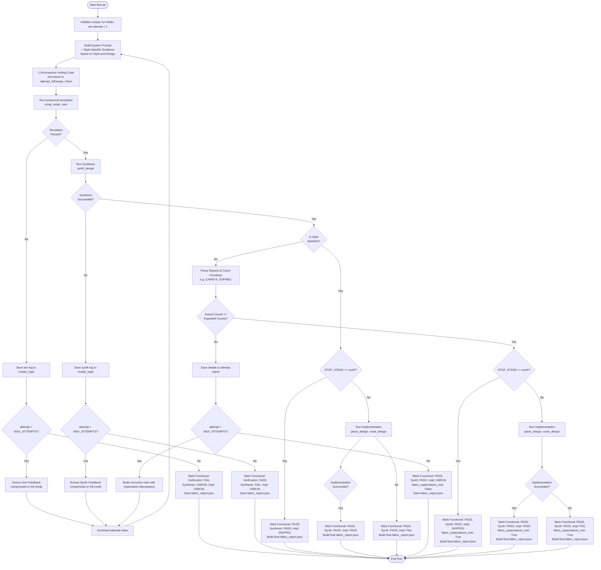

# FPGA-Fabric-RTL-Gen Evaluation

**Fabric-aware LLM RTL generation for AMD/Xilinx 7-Series FPGAs**

FPGA-Fabric-RTL-Gen explores whether an LLM's Verilog generation can be made *aware* of the underlying FPGA fabric — not just functionally correct, but written in a coding style that lets Vivado synthesis map the logic onto specific 7-Series primitives (fast carry chains, DSP slices, wide multiplexers, LUT-based shift registers, block RAM). The pipeline is a self-contained mini-benchmark of 5 hand-authored designs, each targeting one signature primitive, with a bounded self-correction loop when either functional simulation or fabric-primitive verification fails.

The pipeline supports 3 selectable **generation styles** (`--style`) so the same design can be compared under a naive baseline, idiomatic fabric-aware hints, and explicit structural primitive instantiation — see [Generation Styles](#-generation-styles) below.

This module does not modify, import from, or depend on `Evaluation/ResBench/` or `Evaluation/Custom/`; it is fully self-contained within this folder plus the shared `utils.py` / `LLM_Interface/` / `EDA_Interface/` helpers used across LaMDA-FPGA.

---

## 🎯 Overview

The pipeline, for each of the 5 designs:

1. **Injects fabric knowledge** into the LLM system prompt via [`fabric_primer_7series.md`](fabric_primer_7series.md) — a primer covering CLB/slice basics, LUT6/LUT5, CARRY4, DSP48E1, MUXF7/MUXF8, SRLC32E/SRL16E, RAMB18E1/RAMB36E1, and (for the `explicit_primitive` style) structural instantiation templates for `CARRY4`, `DSP48E1`, `MUXF7`/`MUXF8`, and `SRLC32E`. Skipped entirely for the `baseline` style.
2. **Generates** a Verilog design for the target module using a **merged prompt architecture**: output-format and Verilog coding rules live in the pipeline-local system prompt, then a style-specific fabric guidance suffix is appended once per run (none for `baseline`; generic fabric-efficiency reminder + per-design `fabric_hint` for `fabric_aware`; structural-instantiation reminder + per-design `primitive_hint` for `explicit_primitive`). The per-attempt user prompt stays focused on dynamic content (problem statement and corrective retry note, if any).
3. **Simulates** the design against a fixed, pre-authored, self-checking testbench (Vivado behavioral simulation).
4. **Synthesizes** the design (on simulation success) and parses Vivado's `report_utilization` "Primitives" table to count actually-inferred primitives (e.g. `CARRY4`, `DSP48E1`, `MUXF7`, `SRLC32E`).
5. **Compares** actual primitive counts against the dataset's `expected_primitives` minimums (skipped for `baseline`, which only requires simulation + synthesis to pass).
6. **Retries** (up to `--max_attempts` total attempts, including the first) with a corrective prompt built from the actual Vivado log of the single stage that failed — simulation feedback (compile/elaboration errors, or the fixed testbench's failing test vectors) if simulation failed, or synthesis feedback (synthesis errors, or critical warnings as a fallback) if simulation passed but synthesis failed, or (for non-baseline styles) an insufficient/missing fabric primitive if both passed — never mixing sim and synth feedback in the same note. Controlled by `--feedback_mode` (`compressed`: capped, structured extraction; `full`: the complete raw log verbatim); see [Self-Correction Feedback](#-self-correction-feedback) below.
7. **Implements** (place & route) the final design once it passes, or after retries are exhausted, and records the outcome — unless `--stop_stage synth` is set, in which case synthesis is treated as the final stage and implementation is never invoked.

Each run's results are saved to a per-run `fabric_report.json` (see [Output Directory Layout](#-output-directory-layout) below) and appended to an aggregated results JSON (default `fabric_exp_results.json`), which can be converted to CSV for analysis, or compared across styles with `fabric_style_comparison`.

**Scope**: AMD/Xilinx 7-Series only (Artix-7 / Zynq-7000), default part `xc7a100tcsg324-1`. See [`fabric_config.yml`](fabric_config.yml) for supported parts.

---

## 🔄 Execution Flow & Self-Correction Decision Matrix

The diagram below details the pipeline's operational logic, including stage progression, style-based checks, and dynamic feedback selection:



### 🔬 Core Case Analysis

A key design feature of the pipeline is its **strict stage-isolation constraint**. Feedback prompts never mix logs or metrics from multiple phases; instead, the self-correction loop targets the earliest blocker in sequence. There are four distinct failure cases:

#### 1. Simulation Compiling & Elaboration Failures
- **Triggers**: The generated Verilog code has syntax errors (e.g. missing semicolons, unclosed begin-end blocks), references undeclared signals, or contains mismatched module instantiations.
- **Handling**: Behavioral simulation (`xvlog`/`xelab`) fails before launching the testbench. No test result metrics exist.
- **Feedback Generation**:
  - In `compressed` mode, the log parser extracts only lines matching `ERROR:` from `<module>_sim.log` (capped to 10 entries).
  - In `full` mode, the complete compiler and elaboration stdout transcript is provided verbatim.

#### 2. Simulation Behavioral Failures (Functional Mismatches)
- **Triggers**: The Verilog code compiles and elaborates successfully, but registers incorrect logic at runtime during simulation test vectors, causing the self-checking testbench to output failure reports.
- **Handling**: Behavioral run (`xsim`) executes but signals testbench failure.
- **Feedback Generation**:
  - In `compressed` mode, the parser extracts individual failing test vectors ending in `| FAIL` (identifying inputs, expected outputs, and actual system outputs) up to 10 entries. The final summary statement ("Some tests failed") is ignored to avoid prompt noise.
  - In `full` mode, the entire behavioral execution console transcript is provided verbatim.

#### 3. Vivado Synthesis Failures
- **Triggers**: Behavioral simulation was successful (indicating correct execution under simulation rules), but synthesis fails due to constructs that cannot be mapped to hardware. Examples include:
  - Non-synthesizable delays (e.g. `#10`) used within RTL modules.
  - Multidimensional array assignments or loops that Vivado's synthesizable subset doesn't support.
  - Port-width or connectivity discrepancies on structurally-instantiated primitives (e.g., miswired `CARRY4` or `DSP48E1`).
- **Handling**: Synthesis (`synth_design`) fails and no utilization report is produced.
- **Feedback Generation**:
  - In `compressed` mode, the parser searches `<module>_synth.log` for lines beginning with `ERROR:` (capped to 10 entries). If no explicit error line is found but synthesis still timed out or failed, it extracts lines with `CRITICAL WARNING:` as a fallback.
  - In `full` mode, the complete synthesis run log is supplied verbatim.

#### 4. Fabric-Primitive Under-Mapping (Advanced Styles Only)
- **Triggers**: Simulation and synthesis both pass successfully, but the synthesizer maps the high-level or structural description in a way that ignores or under-utilizes the required specialized primitives (e.g., maps an accumulator to general slices/LUTs instead of checking the `expected_primitives` minimum for `DSP48E1`). Ignored in `baseline` style.
- **Handling**: Synthesis passes, but the utilization parser discovers the actual primitive counts are lower than requirements.
- **Feedback Generation**: Since simulation and synthesis succeeded, there are no log-based compile/synthesis errors. The pipeline builds a structured, non-log text block detailing expectation discrepancies:
  - Lists the target primitives with their expected counts vs actual inferred counts.
  - Tells the LLM explicitly which primitive constraints failed, prompting it to adjust its structural wiring or idiomatic coding structure.

#### ⚡ Stop-Stage Optimization Edge-Case
When `--stop_stage synth` is set, implementation is skipped entirely. In the event of a successful synthesis:
- The pipeline marks the `Implementation` metric as `SKIPPED`.
- Utilizations are still parsed and expectations checked.
- Because placement and routing are bypassed, execution times are reduced by up to **80%**, making iterative fabric-exploration sweeps highly efficient.

---

## 🧬 Generation Styles

The `--style` flag (`STYLE` in the Makefile) selects how much fabric guidance the LLM receives, letting the same design be regenerated under 3 conditions for comparison:

| Style | System Prompt (effective) | Per-attempt User Prompt | Pass Criteria |
|-------|----------------|----------------|----------------|
| `baseline` | Pipeline-local system prompt only (includes output markers + Verilog rules; no fabric primer, no extra style guidance) | Dynamic problem/correction content only | Simulation + synthesis only — fabric primitive expectations are **not** checked |
| `fabric_aware` *(default)* | Pipeline-local system prompt + fabric primer + generic fabric-efficiency reminder + per-design `fabric_hint` | Dynamic problem/correction content only | Simulation + synthesis + `fabric_expectations_met` (lets synthesis infer the primitive) |
| `explicit_primitive` | Pipeline-local system prompt + fabric primer (incl. structural templates) + structural-instantiation reminder + per-design `primitive_hint` | Dynamic problem/correction content only | Simulation + synthesis + `fabric_expectations_met` (LLM must structurally instantiate the primitive by name) |

Outputs are namespaced per style, per design, and per invocation — see [Output Directory Layout](#-output-directory-layout) below — so runs of different styles, different designs, or repeated runs of the same design/style never overwrite each other's artifacts (including full Vivado logs for every stage). Use `run_fabric_rtl_gen_all_styles` to run every design under all 3 styles in one pass, and `fabric_style_comparison` to build a per-module, per-style comparison CSV from the aggregated results JSON.

---

## 🗂️ Output Directory Layout

Every invocation of `Run.py` gets its own uniquely-named directory, so **nothing from a previous run is ever overwritten** — not the generated RTL, not the Vivado project, and not the Vivado logs for any stage (simulation, synthesis, implementation):

```text
Outputs/<style>/design_<design_id>_<module>/run_<timestamp>_<pid>/
├── attempt_1/
│   ├── Design_Files/          # Generated Verilog + testbench for this attempt
│   ├── vivado_project/        # Vivado project + reports/{synthesis,implementation}/
│   ├── vivado_logs/           # Full Vivado logs for every stage that ran this attempt:
│   │                         #   <module>_sim.log/.jou, <module>_synth.log/.jou,
│   │                         #   <module>_impl.log/.jou (+ the generated .tcl scripts)
│   └── llm_interaction.json   # Full prompt/response for this attempt's generation call
│                             # (system_prompt, user_prompt, llm_response_raw, tokens,
│                             #  llm_time_s, and feedback_applied - the correction feedback,
│                             #  if any, derived from the PREVIOUS attempt's failure)
├── attempt_2/                 # Present only if a self-correction retry occurred
│   └── ...
└── fabric_report.json         # This run's full report (includes "run_id" for traceability)
```

- `<timestamp>_<pid>` combines a `YYYYMMDD_HHMMSS` timestamp with the process ID, guaranteeing a fresh directory for every invocation — rerunning the same `DESIGN_ID`/`STYLE` (or running concurrently) creates a new `run_*` folder instead of clobbering the previous one.
- Vivado is invoked once per stage per attempt (`sim`, `synth`, optionally `impl`), and each stage writes its own uniquely-named log/journal/tcl files into that attempt's `vivado_logs/`, so all steps for all attempts of a run are preserved side by side.
- With `--verbose`, `Run.py` prints the run directory path at the start (`Run directory (unique per invocation): ...`) and the `fabric_report.json` path at the end.
- The aggregated `fabric_exp_results.json` (or your `--output_json` file) is append-only across all runs/styles/designs and is never overwritten; each entry also records the `run_id` and `style` so it can be traced back to its `Outputs/` directory.
- Use `make STYLE=<style> organize_outputs` if you want to move the most recent run for a given style out of `Outputs/` into a flat `Runs/` archive folder (optional — not required to avoid overwriting, since runs are already uniquely named).

---

## 🩺 Self-Correction Feedback

When an attempt fails, `_build_correction_note` inspects the **single relevant Vivado log** for that attempt and builds a corrective note for the next retry — it never mixes stages:

| Failure | Log inspected | Feedback content |
|---------|----------------|-------------------|
| Simulation failed | `<module>_sim.log` | Compile/elaboration `ERROR:` lines if the design never reached the testbench, otherwise the fixed testbench's failing test vectors (lines containing `FAIL`) |
| Simulation passed, synthesis failed | `<module>_synth.log` | Synthesis `ERROR:` lines, or `CRITICAL WARNING:` lines as a fallback if no explicit error line is found |
| Both passed, fabric primitive missing/insufficient (non-baseline styles) | *(not log-based)* | Structured per-primitive expected-vs-actual counts (unchanged from before) |

Controlled by `--feedback_mode` (`FEEDBACK_MODE` in the Makefile):
- `compressed` *(default)* — a capped, structured extraction (up to `FEEDBACK_MAX_ENTRIES = 10` entries per list, with a "+N more omitted" note if truncated) rendered as a short text block.
- `full` — the complete raw content of the single relevant log file, embedded verbatim with no trimming (larger prompts, zero information loss).

Every attempt also writes its own `Design_Files`-sibling `llm_interaction.json` (see [Output Directory Layout](#-output-directory-layout) above) recording the exact system/user prompt sent, the raw LLM response, token/timing stats, and the `feedback_applied` dict (i.e. the structured feedback derived from the *previous* attempt's failure, `null` for attempt 1) — a complete, per-attempt audit trail separate from the aggregated `fabric_report.json`.

---

## 🗂️ Dataset

[`Dataset/fabric_problems.json`](Dataset/fabric_problems.json) contains 5 designs, each with a natural-language problem spec, a fixed module header, a hand-authored self-checking testbench (and clock constraint where applicable), the primitive(s) it is expected to exercise, a fabric-specific coding hint (`fabric_hint`, used by the `fabric_aware` style), and a structural wiring hint (`primitive_hint`, used by the `explicit_primitive` style).

| ID | Module | Primary Primitive | Expected Primitives |
|----|--------|--------------------|----------------------|
| 1 | `adder_32bit_carry` | `CARRY4` | `CARRY4 >= 8` |
| 2 | `mult_16x16_unsigned` | `DSP48E1` | `DSP48E1 >= 1` |
| 3 | `mac_8x8_accum` (clocked) | `DSP48E1` | `DSP48E1 >= 1` |
| 4 | `mux16to1` | `MUXF7` | `MUXF7 >= 1` |
| 5 | `shift_reg_32_srl` (clocked) | `SRLC32E` | `SRLC32E >= 1` |

Designs #3 and #5 are clocked and include a `Clock Constraint` (XDC) targeting a 10 ns period.

---

## 📊 Evaluation Metrics

#### LLM Metrics
- **Token Count**: Total tokens generated across all attempts
- **LLM Time**: Time spent in LLM generation (seconds)
- **EDA Time**: Time spent in Vivado (seconds)
- **Attempts Used**: Number of generation attempts consumed (1 to `max_attempts`)

#### Verification Metrics
- **Functional Verification**: PASS/FAIL (testbench simulation, last attempt)
- **Synthesis**: PASS/FAIL (synthesis completion, last attempt)
- **Implementation**: PASS/FAIL/SKIPPED (place & route completion, last attempt; SKIPPED when `--stop_stage synth` is used, distinct from an implementation that actually ran and failed)

#### Fabric-Awareness Metrics
- **style**: The generation style used for this run (`baseline`, `fabric_aware`, or `explicit_primitive`)
- **primary_primitive**: The signature primitive targeted by the design
- **expected_primitives**: Dict of primitive → minimum expected count
- **actual_primitives**: Dict of primitive → count observed in Vivado's utilization report
- **fabric_expectations_met**: True only if every expected primitive met its minimum count (always `false`/not evaluated for `baseline`, which does not check fabric expectations)

### Example Result Entry

```json
{
  "ID": 1,
  "module": "adder_32bit_carry",
  "style": "explicit_primitive",
  "run_id": "20260922_143012_48213",
  "llm_model": "gpt-4o",
  "token_count": 1180,
  "llm_time [s]": 3.10,
  "eda_time [s]": 52.40,
  "attempts_used": 1,
  "Functional Verification": "PASS",
  "Synthesis": "PASS",
  "Implementation": "PASS",
  "primary_primitive": "CARRY4",
  "expected_primitives": {"CARRY4": 8},
  "actual_primitives": {"CARRY4": 8, "LUT2": 4},
  "fabric_expectations_met": true
}
```

`run_id` traces this aggregated entry back to its unique `Outputs/<style>/design_<ID>_<module>/run_<run_id>/` directory, where the full Vivado logs for every stage of every attempt are preserved.

---

## 🔨 Makefile Automation

### Available Targets

| Target | Description | Usage |
|--------|-------------|-------|
| `run_fabric_rtl_gen` | Run the pipeline for a single design (single style) | `make MODEL=gpt-4o DESIGN_ID=1 STYLE=fabric_aware run_fabric_rtl_gen` |
| `run_fabric_rtl_gen_all` | Run the pipeline across all 5 designs (single style) | `make MODEL=gpt-4o run_fabric_rtl_gen_all` |
| `run_fabric_rtl_gen_all_styles` | Run the pipeline across all 5 designs x all 3 styles | `make MODEL=gpt-4o run_fabric_rtl_gen_all_styles` |
| `organize_outputs` | Move outputs into a design/timestamp-specific subfolder | `make STYLE=fabric_aware organize_outputs` |
| `clean_outputs` | Remove all generated outputs | `make clean_outputs` |
| `fabric_json_to_csv` | Convert JSON results to full CSV | `make JSON_FILE=fabric_exp_results.json fabric_json_to_csv` |
| `fabric_compress_csv` | Compress full CSV to summary CSV | `make fabric_compress_csv INPUT_CSV=full.csv OUTPUT_CSV=summary.csv` |
| `fabric_generate_csv` | Generate both full and summary CSV from JSON | `make JSON_FILE=fabric_exp_results.json fabric_generate_csv` |
| `fabric_style_comparison` | Build a per-module, per-style comparison CSV | `make JSON_FILE=fabric_exp_results.json fabric_style_comparison` |
| `help` | Display help message | `make help` |

### Quick Start Examples

```bash
cd Evaluation/FPGA-Fabric-RTL-Gen

# Run a single design with GPT-4o (default style: fabric_aware)
make MODEL=gpt-4o DESIGN_ID=1 run_fabric_rtl_gen

# Run the same design under the baseline (naive) and explicit_primitive styles
make MODEL=gpt-4o DESIGN_ID=1 STYLE=baseline run_fabric_rtl_gen
make MODEL=gpt-4o DESIGN_ID=1 STYLE=explicit_primitive run_fabric_rtl_gen

# Run all 5 designs (single style)
make MODEL=gpt-4o run_fabric_rtl_gen_all

# Run all 5 designs across all 3 styles, appending everything to the same JSON_FILE
make MODEL=gpt-4o run_fabric_rtl_gen_all_styles

# Run with a different target part / more self-correction retries
make MODEL=gpt-4o DESIGN_ID=2 FPGA_PART=xc7z020clg400-1 MAX_ATTEMPTS=3 run_fabric_rtl_gen

# Stop after synthesis only (skip place & route/implementation)
make MODEL=gpt-4o DESIGN_ID=1 STOP_STAGE=synth run_fabric_rtl_gen

# Use full (raw log) self-correction feedback instead of the compressed default
make MODEL=gpt-4o DESIGN_ID=2 MAX_ATTEMPTS=3 FEEDBACK_MODE=full run_fabric_rtl_gen

# Generate CSV summaries from the aggregated results
make JSON_FILE=fabric_exp_results.json fabric_generate_csv

# Compare styles side by side (after run_fabric_rtl_gen_all_styles)
make JSON_FILE=fabric_exp_results.json fabric_style_comparison

# Clean outputs
make clean_outputs
```

### Parameters

- `MODEL` - **Required**. LLM model name (e.g., `gpt-4o`, `gemini-2.0-flash-exp`)
- `DESIGN_ID` - Dataset design ID for a single run (default: `1`, range: 1-5)
- `ID_START` / `ID_END` - Design ID range for `run_fabric_rtl_gen_all`(`_styles`) (default: `1`-`5`)
- `MAX_TOKENS` - Maximum tokens for generation (default: `3000`)
- `TEMPERATURE` - Sampling temperature (default: `1.0`)
- `TOP_P` - Top-p sampling parameter (default: `1.0`)
- `FPGA_PART` - Target FPGA part number (default: `xc7a100tcsg324-1`)
- `STYLE` - RTL generation style for single-style targets: `baseline`, `fabric_aware`, or `explicit_primitive` (default: `fabric_aware`)
- `STYLES` - Space-separated styles used by `run_fabric_rtl_gen_all_styles` (default: `baseline fabric_aware explicit_primitive`)
- `MAX_ATTEMPTS` - Maximum total number of generation attempts, including the first (i.e. this many loop calls total; a value of `1` disables self-correction retries entirely) (default: `2`)
- `STOP_STAGE` - Final Vivado stage to run: `synth` (skip place & route/implementation) or `impl` (default: `impl`)
- `FEEDBACK_MODE` - Self-correction log feedback: `compressed` (capped, structured extraction of errors/failing test vectors) or `full` (complete raw log verbatim) (default: `compressed`)
- `JSON_FILE` - Aggregated results JSON file name (default: `fabric_exp_results.json`)
- `INPUT_CSV` / `OUTPUT_CSV` - Full / summary CSV file names
- `COMPARISON_CSV` - Style comparison CSV file name (default: `fabric_style_comparison.csv`)

You can also invoke [`Run.py`](Run.py) directly:

```bash
python Run.py --design_id 1 --model gpt-4o --fpga_part xc7a100tcsg324-1 --style fabric_aware --max_attempts 2 --stop_stage impl --feedback_mode compressed --verbose
```

Use `--style baseline` for a naive control run (no fabric guidance, no fabric-primitive pass/fail requirement), `--style fabric_aware` (default) for idiomatic coding hints that let synthesis infer the primitive, or `--style explicit_primitive` to require the LLM to structurally instantiate the target primitive(s) by name (per the primer's "Structural Instantiation Templates").

Use `--stop_stage synth` to stop after synthesis (skip place & route) — useful when only utilization/fabric-primitive results are needed and implementation time should be avoided. Simulation and synthesis always run; only implementation can be skipped this way.

Use `--feedback_mode full` to feed the complete raw sim/synth log (instead of the capped, structured extraction) to the LLM on a self-correction retry — see [Self-Correction Feedback](#-self-correction-feedback) above.

---

## 📁 Project Structure

```text
FPGA-Fabric-RTL-Gen/
├── Run.py                       # FabricAwarePipeline orchestrator (styles, generation, sim, synth, impl, retries)
├── Makefile                     # Evaluation automation targets
├── fabric_primer_7series.md     # Xilinx 7-Series fabric knowledge injected into the system prompt
├── fabric_config.yml            # Supported/default FPGA parts and primitive metadata
├── Dataset/
│   └── fabric_problems.json     # 5-design mini-benchmark (problems, testbenches, fabric_hint, primitive_hint)
├── Analysis/
│   ├── FabricAnalysis.py        # Self-contained Vivado report parser + JSON→CSV aggregation + style comparison
│   └── test_fabric_parser.py    # Offline unit check for the primitives-table parser (no Vivado required)
└── Outputs/                     # Generated per-style/per-design/per-run artifacts (never overwritten):
                                  #   Outputs/<style>/design_<id>_<module>/run_<timestamp>_<pid>/
                                  #     attempt_N/{Design_Files,vivado_project,vivado_logs}
                                  #     fabric_report.json
                                  #   See "Output Directory Layout" above for details.
```

---

## ⚠️ Limitations

- **Heuristic expectations**: `expected_primitives` are minimum-count heuristics, not formal proofs of optimal fabric mapping; a design can pass functional verification and still be judged "fabric-unaware" if the synthesizer maps it differently than expected (or vice versa).
- **Vivado-version dependent naming**: Primitive names/categories in `report_utilization`'s "Primitives" table can vary slightly across Vivado versions; the parser matches the standard `| Ref Name | Used | Functional Category |` table format.
- **7-Series only**: The fabric primer, primitive expectations, and default part are scoped to Artix-7 / Zynq-7000 (7-series). Other families (UltraScale, Versal) are out of scope.
- **Requires Vivado + LLM API access**: Like the rest of LaMDA-FPGA, this pipeline requires `VIVADO_PATH` to be set and at least one LLM API key configured (see the root [README.md](../../README.md)).
