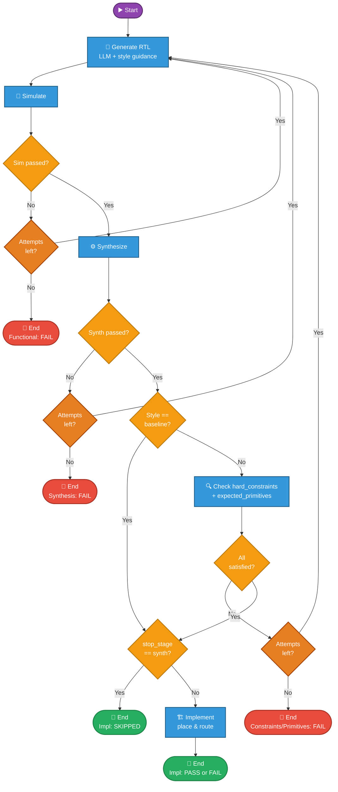

# FPGA-Fabric-RTL-Gen Evaluation

**Fabric-aware LLM RTL generation for AMD/Xilinx 7-Series FPGAs**

FPGA-Fabric-RTL-Gen explores whether an LLM's Verilog generation can be made *aware* of the underlying FPGA fabric — not just functionally correct, but written in a coding style that lets Vivado synthesis map the logic onto specific 7-Series primitives (fast carry chains, DSP slices, wide multiplexers, LUT-based shift registers, block RAM). The pipeline is a self-contained mini-benchmark of 15 hand-authored designs, each targeting one signature primitive (or, for a couple of designs, an architecturally flexible pair of primitives), with a bounded self-correction loop when functional simulation, fabric-primitive verification, or (where defined) a dataset-specific hard constraint — resource cap (including LUT/register usage), timing slack, critical-warning count, DSP register configuration, DSP datapath packing, or a primitive-alternatives budget — fails.

The pipeline supports 3 selectable **generation styles** (`--style`) so the same design can be compared under a naive baseline, idiomatic fabric-aware hints, and explicit structural primitive instantiation — see [Generation Styles](#-generation-styles) below.

This module does not modify, import from, or depend on `Evaluation/ResBench/` or `Evaluation/Custom/`; it is fully self-contained within this folder plus the shared `utils.py` / `LLM_Interface/` / `EDA_Interface/` helpers used across LaMDA-FPGA.

---

## 🎯 Overview

The pipeline, for each of the 16 designs:

1. **Injects fabric knowledge** into the LLM system prompt via [`fabric_primer_7series.md`](fabric_primer_7series.md) — a primer covering CLB/slice basics, LUT6/LUT5, CARRY4, DSP48E1, MUXF7/MUXF8, SRLC32E/SRL16E, RAMB18E1/RAMB36E1, and (for the `explicit_primitive` style) structural instantiation templates for `CARRY4`, `DSP48E1`, `MUXF7`/`MUXF8`, `SRLC32E`, `RAM32X1S`, and `RAMB18E1`. Skipped entirely for the `baseline` style.
2. **Generates** a Verilog design for the target module using a **merged prompt architecture**: output-format and Verilog coding rules live in the pipeline-local system prompt, then a style-specific fabric guidance suffix is appended once per run (none for `baseline`; generic fabric-efficiency reminder + per-design `fabric_hint` for `fabric_aware`; structural-instantiation reminder + per-design `primitive_hint` for `explicit_primitive`). The per-attempt user prompt stays focused on dynamic content (problem statement and corrective retry note, if any).
3. **Simulates** the design against a fixed, pre-authored, self-checking testbench (Vivado behavioral simulation).
4. **Synthesizes** the design (on simulation success) and parses Vivado's `report_utilization` "Primitives" table to count actually-inferred primitives (e.g. `CARRY4`, `DSP48E1`, `MUXF7`, `SRLC32E`).
5. **Compares** actual primitive counts against the dataset's `expected_primitives` minimums (skipped for `baseline`, which only requires simulation + synthesis to pass).
6. **Evaluates** any dataset-defined `hard_constraints` for the design against the parsed synthesis results — required primitive minimums, resource caps (including the derived `FF_TOTAL` metric, the sum of all flip-flop primitives: `FDRE`/`FDCE`/`FDPE`/`FDSE`/`FDC`/`FDP`, plus the `LUT_USED`/`REGISTER_USED` metrics sourced from `report_utilization`'s Slice-Logic summary), forbidden primitives, a post-synthesis timing budget (`timing.min_slack_ns`, pre-route only — see [Limitations](#-limitations)), a cap on total `CRITICAL WARNING:` lines emitted during synthesis (`max_critical_warnings`, always parsed regardless of pass/fail — see the multi-driven-net case below), a DSP48E1 register configuration check (`dsp_register_config`, verified against the synthesis log's "DSP Final Report" table), a DSP datapath-packing check (`dsp_datapath_pattern`, a regex matched against the same table's "DSP Mapping" string, e.g. confirming a multiply-accumulate stayed packed in one DSP instance rather than being split across the DSP and fabric logic), and a primitive-alternatives budget (`primitive_alternatives`, letting a design accept two architecturally distinct, equally-valid implementations instead of forcing one "correct" primitive). A design's `hard_constraints` block is entirely optional and, when present, targets a specific documented synthesis anti-pattern rather than a generic primitive-presence check (see [Dataset](#-dataset) below). Skipped for `baseline`, same as the fabric-primitive check.
7. **Retries** (up to `--max_attempts` total attempts, including the first) with a corrective prompt built from the single relevant failure signal — simulation feedback (compile/elaboration errors, or the fixed testbench's failing test vectors) if simulation failed, or synthesis feedback (synthesis errors, or critical warnings as a fallback) if simulation passed but synthesis failed, or (for non-baseline styles) a hard-constraint violation if one is defined and unmet (including a critical-path cell-type diagnosis when the violation is a timing-slack failure — see [Self-Correction Feedback](#-self-correction-feedback) below), or an insufficient/missing fabric primitive otherwise — never mixing feedback types in the same note. Controlled by `--feedback_mode` (`compressed`: capped, structured extraction; `full`: the complete raw log verbatim); see [Self-Correction Feedback](#-self-correction-feedback) below.
8. **Implements** (place & route) the final design once it passes, or after retries are exhausted, and records the outcome — unless `--stop_stage synth` is set, in which case synthesis is treated as the final stage and implementation is never invoked.

Each run's results are saved to a per-run `fabric_report.json` (see [Output Directory Layout](#-output-directory-layout) below) and appended to an aggregated results JSON (default `fabric_exp_results.json`), which can be converted to CSV for analysis, or compared across styles with `fabric_style_comparison`.

**Scope**: AMD/Xilinx 7-Series only (Artix-7 / Zynq-7000), default part `xc7a100tcsg324-1`. See [`fabric_config.yml`](fabric_config.yml) for supported parts.

---

## 🔄 Execution Flow & Self-Correction Decision Matrix

The diagram below is a simplified, color-coded view of the pipeline's core decision flow — one box per pipeline stage, one diamond per pass/fail decision, and a single retry loop back to generation. See [Core Case Analysis](#-core-case-analysis) below for the full per-case detail (exact feedback content, which log is inspected, style-specific nuances, etc.) that this diagram intentionally leaves out for readability.


```mermaid
flowchart TD
    Start(["▶️ Start"]) --> Gen["📝 Generate RTL<br/>LLM + style guidance"]
    Gen --> Sim["🧪 Simulate"]
    Sim --> SimOK{"Sim passed?"}

    SimOK -- No --> RetrySim{"Attempts<br/>left?"}
    RetrySim -- Yes --> Gen
    RetrySim -- No --> FailSim(["🛑 End<br/>Functional: FAIL"])

    SimOK -- Yes --> Synth["⚙️ Synthesize"]
    Synth --> SynthOK{"Synth passed?"}

    SynthOK -- No --> RetrySynth{"Attempts<br/>left?"}
    RetrySynth -- Yes --> Gen
    RetrySynth -- No --> FailSynth(["🛑 End<br/>Synthesis: FAIL"])

    SynthOK -- Yes --> StyleCheck{"Style ==<br/>baseline?"}
    StyleCheck -- Yes --> StopCheck
    StyleCheck -- No --> Checks["🔍 Check hard_constraints<br/>+ expected_primitives"]
    Checks --> ChecksOK{"All<br/>satisfied?"}

    ChecksOK -- No --> RetryChecks{"Attempts<br/>left?"}
    RetryChecks -- Yes --> Gen
    RetryChecks -- No --> FailChecks(["🛑 End<br/>Constraints/Primitives: FAIL"])

    ChecksOK -- Yes --> StopCheck{"stop_stage<br/>== synth?"}
    StopCheck -- Yes --> SkipEnd(["🏁 End<br/>Impl: SKIPPED"])
    StopCheck -- No --> Impl["🏗️ Implement<br/>place & route"]
    Impl --> ImplEnd(["🏁 End<br/>Impl: PASS or FAIL"])

    classDef startEnd fill:#8e44ad,color:#ffffff,stroke:#5b2c6f,stroke-width:2px;
    classDef process fill:#3498db,color:#ffffff,stroke:#21618c,stroke-width:2px;
    classDef decision fill:#f39c12,color:#ffffff,stroke:#b9770e,stroke-width:2px;
    classDef retry fill:#e67e22,color:#ffffff,stroke:#a04000,stroke-width:2px;
    classDef good fill:#27ae60,color:#ffffff,stroke:#1e8449,stroke-width:2px;
    classDef bad fill:#e74c3c,color:#ffffff,stroke:#a93226,stroke-width:2px;

    class Start startEnd;
    class Gen,Sim,Synth,Checks,Impl process;
    class SimOK,SynthOK,StyleCheck,ChecksOK,StopCheck decision;
    class RetrySim,RetrySynth,RetryChecks retry;
    class SkipEnd,ImplEnd good;
    class FailSim,FailSynth,FailChecks bad;
```

### 🔬 Core Case Analysis

A key design feature of the pipeline is its **strict stage-isolation constraint**. Feedback prompts never mix logs or metrics from multiple phases; instead, the self-correction loop targets the earliest blocker in sequence. There are five distinct failure cases:

#### 1. Simulation Compiling & Elaboration Failures
- **Triggers**: The generated Verilog code has syntax errors (e.g. missing semicolons, unclosed begin-end blocks), references undeclared signals, or contains mismatched module instantiations.
- **Handling**: Behavioral simulation (`xvlog`/`xelab`) fails before launching the testbench. No test result metrics exist.
- **Feedback Generation**:
  - In `compressed` mode, the log parser extracts only lines matching `ERROR:` from `<module>_sim.log` (capped to 10 entries).
  - In `full` mode, the complete compiler and elaboration stdout transcript is provided verbatim.

#### 2. Simulation Behavioral Failures (Functional Mismatches)
- **Triggers**: The Verilog code compiles and elaborates successfully, but registers incorrect logic at runtime during simulation test vectors, causing the self-checking testbench to output failure reports.
- **Handling**: Behavioral run (`xsim`) executes but signals testbench failure.
- **Feedback Generation**:
  - In `compressed` mode, the parser extracts individual failing test vectors ending in `| FAIL` (identifying inputs, expected outputs, and actual system outputs) up to 10 entries. The final summary statement ("Some tests failed") is ignored to avoid prompt noise.
  - In `full` mode, the entire behavioral execution console transcript is provided verbatim.

#### 3. Vivado Synthesis Failures
- **Triggers**: Behavioral simulation was successful (indicating correct execution under simulation rules), but synthesis fails due to constructs that cannot be mapped to hardware. Examples include:
  - Non-synthesizable delays (e.g. `#10`) used within RTL modules.
  - Multidimensional array assignments or loops that Vivado's synthesizable subset doesn't support.
  - Port-width or connectivity discrepancies on structurally-instantiated primitives (e.g., miswired `CARRY4` or `DSP48E1`).
- **Handling**: Synthesis (`synth_design`) fails and no utilization report is produced.
- **Feedback Generation**:
  - In `compressed` mode, the parser searches `<module>_synth.log` for lines beginning with `ERROR:` (capped to 10 entries). If no explicit error line is found but synthesis still timed out or failed, it extracts lines with `CRITICAL WARNING:` as a fallback.
  - In `full` mode, the complete synthesis run log is supplied verbatim.

#### 4. Hard Resource/Timing Constraint Violation (Advanced Styles Only, Optional Per-Design)
- **Triggers**: Simulation and synthesis both pass, but the design defines a `hard_constraints` block (see [Dataset](#-dataset) below) and the parsed synthesis results violate it. Checked *before* the generic fabric-primitive check below, and only for designs that actually define `hard_constraints` — most designs don't, since a constraint is only added when it maps to a real, plausible synthesis outcome. Ignored in `baseline` style. Sub-cases:
  - **Resource caps** — e.g. a multiply-accumulate design re-registers the `DSP48E1` accumulator output in fabric (spurious `FF_TOTAL` above the cap), or a shift register falls back to a discrete flip-flop chain instead of packing into `SRLC32E` (`FF_TOTAL` above the cap).
  - **Timing slack (`timing.min_slack_ns`)** — the design closes synthesis but the worst post-synthesis path (`report_timing`, pre-route — see [Limitations](#-limitations)) violates the dataset's minimum required slack against its `Clock Constraint`. Feedback for this sub-case additionally includes a **critical-path diagnosis**: the ordered cell-type breakdown of the worst path (e.g. `CARRY4=8 IBUF=1 LUT2=1 OBUF=1`, parsed from `report_timing`'s "Logic Levels" summary), so the LLM can distinguish a combinational-logic-bound path (candidate fix: add pipeline registers, reduce combinational depth) from a routing-bound one.
  - **Critical warnings (`max_critical_warnings`)** — synthesis emitted more `CRITICAL WARNING:` lines than allowed. This is the confirmed **multi-driven-net silent-pass case**: structurally instantiating a primitive (e.g. `SRLC32E`) while *also* leaving a fabric-inferred driver on the same output net produces a `CRITICAL WARNING: [Synth 8-6859] multi-driven net on pin ...` — Vivado does not downgrade this to an ERROR, so synthesis reports success while the netlist is actually broken. Unlike the ERROR/CRITICAL-WARNING-as-fallback logic in [case 3](#3-vivado-synthesis-failures) above, critical warnings are now parsed on **every** successful synthesis (not just as a failure fallback), so this case is caught even though the synthesis step itself "succeeds".
  - **DSP register configuration (`dsp_register_config`)** — every inferred `DSP48E1` instance's register flags (`AREG`/`BREG`/`CREG`/`DREG`/`ADREG`/`MREG`/`PREG`), parsed from the synthesis log's "DSP Final Report" table, must match the dataset's expected 0/1 values (e.g. requiring `PREG: 1` so the accumulator is registered *inside* the DSP slice rather than in fabric).
- **Handling**: Synthesis passes, but `_evaluate_hard_constraints` finds at least one violated `required_primitives_min`, `resource_caps` (including `FF_TOTAL`), `forbidden_primitives`, `timing`, `max_critical_warnings`, or `dsp_register_config` entry.
- **Feedback Generation**: A structured, non-log text block listing each violated constraint as `name: expected <op> X, got Y`, instructing the LLM to rewrite the RTL so the constraint is met while preserving functional behavior and the module interface; the critical-path diagnosis (above) is appended only when the violation includes a timing-slack failure.

#### 5. Fabric-Primitive Under-Mapping (Advanced Styles Only)
- **Triggers**: Simulation and synthesis both pass successfully, hard constraints (if any) are satisfied, but the synthesizer maps the high-level or structural description in a way that ignores or under-utilizes the required specialized primitives (e.g., maps an accumulator to general slices/LUTs instead of checking the `expected_primitives` minimum for `DSP48E1`). Ignored in `baseline` style.
- **Handling**: Synthesis passes, but the utilization parser discovers the actual primitive counts are lower than requirements.
- **Feedback Generation**: Since simulation and synthesis succeeded and hard constraints (if any) passed, there are no log-based compile/synthesis errors or constraint violations. The pipeline builds a structured, non-log text block detailing expectation discrepancies:
  - Lists the target primitives with their expected counts vs actual inferred counts.
  - Tells the LLM explicitly which primitive constraints failed, prompting it to adjust its structural wiring or idiomatic coding structure.

#### ⚡ Stop-Stage Optimization Edge-Case
When `--stop_stage synth` is set, implementation is skipped entirely. In the event of a successful synthesis:
- The pipeline marks the `Implementation` metric as `SKIPPED`.
- Utilizations are still parsed and expectations checked.
- Because placement and routing are bypassed, execution times are reduced by up to **80%**, making iterative fabric-exploration sweeps highly efficient.

---

## 🧬 Generation Styles

The `--style` flag (`STYLE` in the Makefile) selects how much fabric guidance the LLM receives, letting the same design be regenerated under 3 conditions for comparison:

| Style | System Prompt (effective) | Per-attempt User Prompt | Pass Criteria |
|-------|----------------|----------------|----------------|
| `baseline` | Pipeline-local system prompt only (includes output markers + Verilog rules; no fabric primer, no extra style guidance) | Dynamic problem/correction content only (no `hard_constraints` guidance) | Simulation + synthesis only — fabric primitive expectations and hard constraints are **not** checked |
| `fabric_aware` *(default)* | Pipeline-local system prompt + fabric primer + generic fabric-efficiency reminder + per-design `fabric_hint` | Problem/correction content + optional `hard_constraints` guidance (if the design defines one) | Simulation + synthesis + `fabric_expectations_met` + `hard_constraints_met` (if defined) — lets synthesis infer the primitive |
| `explicit_primitive` | Pipeline-local system prompt + fabric primer (incl. structural templates) + structural-instantiation reminder + per-design `primitive_hint` | Problem/correction content + optional `hard_constraints` guidance (if the design defines one) | Simulation + synthesis + `fabric_expectations_met` + `hard_constraints_met` (if defined) — LLM must structurally instantiate the primitive by name |

Outputs are namespaced per style, per design, and per invocation — see [Output Directory Layout](#-output-directory-layout) below — so runs of different styles, different designs, or repeated runs of the same design/style never overwrite each other's artifacts (including full Vivado logs for every stage). Use `run_fabric_rtl_gen_all_styles` to run every design under all 3 styles in one pass, and `fabric_style_comparison` to build a per-module, per-style comparison CSV from the aggregated results JSON.

---

## 🗂️ Output Directory Layout

Every invocation of `Run.py` gets its own uniquely-named directory, so **nothing from a previous run is ever overwritten** — not the generated RTL, not the Vivado project, and not the Vivado logs for any stage (simulation, synthesis, implementation):

```text
Outputs/<style>/design_<design_id>_<module>/run_<timestamp>_<pid>/
├── attempt_1/
│   ├── Design_Files/          # Generated Verilog + testbench for this attempt
│   ├── vivado_project/        # Vivado project + reports/{synthesis,implementation}/
│   ├── vivado_logs/           # Full Vivado logs for every stage that ran this attempt:
│   │                         #   <module>_sim.log/.jou, <module>_synth.log/.jou,
│   │                         #   <module>_impl.log/.jou (+ the generated .tcl scripts)
│   └── llm_interaction.json   # Full prompt/response for this attempt's generation call
│                             # (system_prompt, user_prompt, llm_response_raw, tokens,
│                             #  llm_time_s, and feedback_applied - the correction feedback,
│                             #  if any, derived from the PREVIOUS attempt's failure)
├── attempt_2/                 # Present only if a self-correction retry occurred
│   └── ...
└── fabric_report.json         # This run's full report (includes "run_id" for traceability)
```

- `<timestamp>_<pid>` combines a `YYYYMMDD_HHMMSS` timestamp with the process ID, guaranteeing a fresh directory for every invocation — rerunning the same `DESIGN_ID`/`STYLE` (or running concurrently) creates a new `run_*` folder instead of clobbering the previous one.
- Vivado is invoked once per stage per attempt (`sim`, `synth`, optionally `impl`), and each stage writes its own uniquely-named log/journal/tcl files into that attempt's `vivado_logs/`, so all steps for all attempts of a run are preserved side by side.
- With `--verbose`, `Run.py` prints the run directory path at the start (`Run directory (unique per invocation): ...`) and the `fabric_report.json` path at the end.
- The aggregated `fabric_exp_results.json` (or your `--output_json` file) is append-only across all runs/styles/designs and is never overwritten; each entry also records the `run_id` and `style` so it can be traced back to its `Outputs/` directory.
- Use `make STYLE=<style> organize_outputs` if you want to move the most recent run for a given style out of `Outputs/` into a flat `Runs/` archive folder (optional — not required to avoid overwriting, since runs are already uniquely named).

---

## 🩺 Self-Correction Feedback

When an attempt fails, `_build_correction_note` inspects the **single relevant Vivado log** for that attempt and builds a corrective note for the next retry — it never mixes stages:

| Failure | Log inspected | Feedback content |
|---------|----------------|-------------------|
| Simulation failed | `<module>_sim.log` | Compile/elaboration `ERROR:` lines if the design never reached the testbench, otherwise the fixed testbench's failing test vectors (lines containing `FAIL`) |
| Simulation passed, synthesis failed | `<module>_synth.log` | Synthesis `ERROR:` lines, or `CRITICAL WARNING:` lines as a fallback if no explicit error line is found |
| Both passed, hard constraint violated (non-baseline styles, only if the design defines `hard_constraints`) | *(not log-based, plus `report_timing`'s "Logic Levels" line when the violation is timing-slack)* | Structured per-constraint expected-vs-actual violations (`required_primitives_min`, `resource_caps` incl. `FF_TOTAL`, `forbidden_primitives`, `timing.min_slack_ns`, `max_critical_warnings`, `dsp_register_config`) — checked and reported *before* the generic fabric-primitive check below; a timing-slack violation additionally includes the critical-path cell-type breakdown (see [Core Case Analysis](#-core-case-analysis) case 4 above) |
| Both passed, hard constraints satisfied (or none defined), fabric primitive missing/insufficient (non-baseline styles) | *(not log-based)* | Structured per-primitive expected-vs-actual counts |

Controlled by `--feedback_mode` (`FEEDBACK_MODE` in the Makefile):
- `compressed` *(default)* — a capped, structured extraction (up to `FEEDBACK_MAX_ENTRIES = 10` entries per list, with a "+N more omitted" note if truncated) rendered as a short text block.
- `full` — the complete raw content of the single relevant log file, embedded verbatim with no trimming (larger prompts, zero information loss).

Every attempt also writes its own `Design_Files`-sibling `llm_interaction.json` (see [Output Directory Layout](#-output-directory-layout) above) recording the exact system/user prompt sent, the raw LLM response, token/timing stats, and the `feedback_applied` dict (i.e. the structured feedback derived from the *previous* attempt's failure, `null` for attempt 1) — a complete, per-attempt audit trail separate from the aggregated `fabric_report.json`.

---

## 🗂️ Dataset

[`Dataset/fabric_problems.json`](Dataset/fabric_problems.json) contains 16 designs, each with a natural-language problem spec, a fixed module header, a hand-authored self-checking testbench (and clock constraint where applicable), the primitive(s) it is expected to exercise, a fabric-specific coding hint (`fabric_hint`, used by the `fabric_aware` style), and a structural wiring hint (`primitive_hint`, used by the `explicit_primitive` style).

| ID | Module | Primary Primitive | Expected Primitives | Hard Constraints |
|----|--------|--------------------|----------------------|-------------------|
| 1 | `adder_32bit_carry` | `CARRY4` | `CARRY4 >= 8` | *(none)* |
| 2 | `mult_16x16_unsigned` | `DSP48E1` | `DSP48E1 >= 1` | `max_critical_warnings: 0` |
| 3 | `mac_8x8_accum` (clocked) | `DSP48E1` | `DSP48E1 >= 1` | `FF_TOTAL <= 4`, `max_critical_warnings: 0`, `PREG: 1`, `dsp_datapath_pattern: (P+A*B)` |
| 4 | `mux16to1` | `MUXF7` | `MUXF7 >= 1` | *(none)* |
| 5 | `shift_reg_32_srl` (clocked) | `SRLC32E` | `SRLC32E >= 1` | `FF_TOTAL <= 4`, `max_critical_warnings: 0` |
| 6 | `ram32x8_distributed` (clocked) | Distributed RAM (LUT RAM) | `RAMS32 >= 8` | `RAMB18E1 <= 0`, `RAMB36E1 <= 0` |
| 7 | `mult_16x16_no_dsp` | `CARRY4` | `CARRY4 >= 1` | `forbidden: DSP48E1` |
| 8 | `adder_64bit_carry` | `CARRY4` | `CARRY4 >= 16` | *(none)* |
| 9 | `fir_tap_srl_dsp` (clocked, tight 2.5 ns period) | `DSP48E1` | `SRLC32E >= 8`, `DSP48E1 >= 1` | `FF_TOTAL <= 4`, `max_critical_warnings: 0`, `PREG: 1`, `timing.min_slack_ns: 0.0`, `dsp_datapath_pattern: (P+A*B)` |
| 10 | `ram256x16_bram` (clocked) | `RAMB18E1` | `RAMB18E1 >= 1` | `FF_TOTAL <= 32` |
| 11 | `wide_reduce_flexible_arch` | `CARRY4` or `DSP48E1` | *(none — checked via `primitive_alternatives`)* | `primitive_alternatives: {CARRY4,DSP48E1} total >= 2`, `max_critical_warnings: 0` |
| 12 | `mult_16x16_dsp_registered` (clocked) | `DSP48E1` | `DSP48E1 >= 1` | `FF_TOTAL <= 32`, `max_critical_warnings: 0`, `PREG: 1` |
| 13 | `mult_16x16_no_dsp_tight_timing` (clocked, tight 8 ns period) | `CARRY4` | `CARRY4 >= 1` | `forbidden: DSP48E1`, `max_critical_warnings: 0`, `timing.min_slack_ns: 0.0` |
| 14 | `mult_16x16_dsp_combinational` | `DSP48E1` | `DSP48E1 >= 1` | `max_critical_warnings: 0` |
| 15 | `ram128x32_distributed_pressure` (clocked) | `RAM128X1S` | `RAM128X1S >= 32` | `RAMB18E1 <= 0`, `RAMB36E1 <= 0`, `LUT_USED <= 220` |
| 16 | `ram128x32_bram_pressure` (clocked) | `RAMB36E1` | `RAMB36E1 >= 1` | `FF_TOTAL <= 64` |

Designs #3, #5, #6, #9, #10, #12, #13, #15, and #16 are clocked; #3/#5/#6/#10/#12/#15/#16 target a 10 ns period, #9 deliberately targets a tight 2.5 ns (400 MHz) period, and #13 targets a tight 8 ns (125 MHz) period — both #9 and #13 exercise the timing-feedback loop (see [Timing/Critical-Path Ablation](#-timingcritical-path-ablation) below). Designs #11 and #14 are fully combinational (no clock). ID #17 remains reserved for a future expected-infeasible design.

> **Design #6 note**: `expected_primitives` requires `RAMS32 >= 8` for `ram32x8_distributed`. `RAMS32`/`RAM32X1S` are two Vivado `report_utilization` `Ref Name`s for the *same* underlying distributed-RAM hardware, reached via two different code paths: `RAMS32` ("Distributed Memory" functional category) is the name reported when the RAM is **behaviorally inferred** (`fabric_aware` style's idiomatic `reg [7:0] mem [0:31]` coding style — confirmed via a live synthesis run), while `RAM32X1S` is the name reported when it is **structurally instantiated** by name (`explicit_primitive` style, per the RAM32X1S template in `fabric_primer_7series.md` — 8 instances, one per output data bit, confirmed via Vivado's own UNISIM HDL Language Template). Because the two styles produce different `Ref Name`s for an equally-correct design, `check_fabric_expectations()` in [utils.py](../../utils.py) treats `RAMS32`/`RAM32X1S` as aliases of each other (see `PRIMITIVE_ALIASES`) so either name satisfies the `RAMS32 >= 8` check regardless of which style produced it. (An earlier version of this dataset entry used `RAM32X1S` as the sole expected key with no alias handling, which caused false-negative fabric-mismatch feedback on an otherwise-correct `fabric_aware` design.) This is checked alongside the `resource_caps` constraint (`RAMB18E1`/`RAMB36E1` must both be `0`, i.e. the RAM must NOT be block-RAM-mapped).

#### Hard Constraints (Optional, Only Where They Test a Real Anti-Pattern)

A design's optional `hard_constraints` object goes beyond "was the primitive present" to test *how* the fabric was used — but only where the constraint corresponds to a plausible, real Vivado synthesis outcome, not a decorative check added for symmetry. Supported keys:

- **`required_primitives_min` / `resource_caps` / `forbidden_primitives`** (Phase 1, original schema): minimum/maximum/forbidden primitive counts, including two derived metrics: `FF_TOTAL` (the sum of all flip-flop primitives observed in the utilization report — `FDRE`/`FDCE`/`FDPE`/`FDSE`/`FDC`/`FDP`) and `LUT_USED`/`REGISTER_USED` (the "Slice LUTs"/"Slice Registers" used-count from `report_utilization`'s Slice-Logic summary — previously parsed but discarded, now wired through `_parse_resources`/`_constraint_metric_value`).
  - **`mac_8x8_accum`** (`FF_TOTAL <= 4`): `DSP48E1`'s `PREG` already registers the accumulator; if the LLM additionally re-registers `acc` in fabric with a second `always @(posedge clk)` block (the "double-registration" anti-pattern documented in the fabric primer), that adds ~20 spurious flip-flops and an extra cycle of latency.
  - **`shift_reg_32_srl`** (`FF_TOTAL <= 4`): the idiomatic/idiomatic-adjacent styles are supposed to let synthesis pack the 32-stage shift into a single `SRLC32E`; falling back to 32 discrete `FDRE` registers is a real, observed failure mode (functionally correct, fabric-inefficient).
  - **`mult_16x16_no_dsp`** (`forbidden_primitives: ["DSP48E1"]`): the mirror-image case of design #2 — checks that a plain adder-tree multiplier is NOT accidentally packed into a DSP slice.
  - **`ram32x8_distributed`** (`resource_caps: {"RAMB18E1": 0, "RAMB36E1": 0}`, plus `expected_primitives: {"RAMS32": 8}`): see the design #6 note above.
  - **`ram256x16_bram`** (`resource_caps: {"FF_TOTAL": 32}`, plus `expected_primitives: {"RAMB18E1": 1}`): the mirror-image case of design #6 — a 256x16 (4Kbit) memory with a synchronous/registered read is large enough and idiomatically shaped to map onto a dedicated Block RAM tile, but if the LLM instead describes a combinational/asynchronous read (blocking BRAM inference, per the primer's documented anti-pattern) synthesis would fall back to either distributed RAM or, worse, a flat bank of ~4096 discrete flip-flops. The `RAMB18E1 >= 1` expectation alone already catches a distributed-RAM fallback (regardless of its exact `Ref Name`), while `FF_TOTAL <= 32` specifically catches the flip-flop-array fallback. `RAMB18E1`/`RAMB36E1` are treated as aliases of each other (see `PRIMITIVE_ALIASES` in [utils.py](../../utils.py)), since Vivado's own block-RAM tile-packing heuristics may choose either primitive for a memory this size.
  - **`ram128x32_distributed_pressure`** (design #15, `resource_caps: {"RAMB18E1": 0, "RAMB36E1": 0, "LUT_USED": 220}`, plus `expected_primitives: {"RAM128X1S": 32}`): the same distributed-RAM idiom as design #6, scaled to a wider/deeper 128x32 memory, but now additionally uses the new `LUT_USED` metric as a tight resource-pressure cap — a naive, non-primitive-packed implementation of the same 128-deep memory would burn substantially more LUTs than 32 structurally-packed `RAM128X1S` instances (4 LUT6 each), so this cap rejects functionally-correct-but-inefficient fabric usage, not just wrong primitive choice.
  - **`ram128x32_bram_pressure`** (design #16, `resource_caps: {"FF_TOTAL": 64}`, plus `expected_primitives: {"RAMB36E1": 1}`): the mirror-image case of design #15 (same 128x32 function, synchronous/registered read instead of combinational), sized so a single `RAMB36E1` (36-bit-wide/1024-deep native mode) is the natural fit, with `FF_TOTAL <= 64` catching a flip-flop-array fallback exactly as `ram256x16_bram`'s cap does at half the width.
- **`timing`** (Phase 2): `{"min_slack_ns": <float>}`. The post-synthesis worst slack (parsed from `report_timing`, **pre-route only** — see [Limitations](#-limitations)) must be `>=` this value against the design's `Clock Constraint`. Defined by `fir_tap_srl_dsp` (design #9, tight 2.5 ns period) and `mult_16x16_no_dsp_tight_timing` (design #13, tight 8 ns period), specifically to give the self-correction loop a timing-driven retry to react to (see [Timing/Critical-Path Ablation](#-timingcritical-path-ablation) below).
- **`max_critical_warnings`** (Phase 2.5): an integer cap on the total number of `CRITICAL WARNING:` lines in the synthesis log, parsed on **every** successful synthesis regardless of pass/fail (not just as an error fallback, unlike the [case 3](#3-vivado-synthesis-failures) log extraction). Added to designs #2, #3, #5, #9, #11, #13 — all designs where a plausible multi-driven-net or similar critical-warning anti-pattern could silently corrupt the netlist while synthesis still reports success (the confirmed, real-world motivating case: structurally instantiating `SRLC32E` for `shift_reg_32_srl` while also leaving a fabric-inferred driver on `serial_out` produced exactly this warning in a captured run).
- **`dsp_register_config`** (Phase 2.5): `{"AREG"/"BREG"/.../"PREG": 0 or 1, ...}`. Every inferred `DSP48E1` instance's register flags, parsed from the synthesis log's "DSP Final Report" table, must match. Added to designs #3, #9, and #12 (all require `PREG: 1`, i.e. the multiply/accumulate result must be registered inside the DSP slice, not by a spurious extra fabric register — this is the *structural* counterpart to the `FF_TOTAL` cap on the same designs).
- **`dsp_datapath_pattern`** (new): a regex string matched against every inferred `DSP48E1` instance's "DSP Mapping" string from the synthesis log's "DSP Final Report" table (e.g. `"(P+A*B)'"`), satisfied if **at least one** instance matches. This is a text-pattern heuristic (same caveat as the critical-path cell-type parser, not a formal netlist-topology check) confirming the multiply and the accumulation stayed packed into a single DSP instance's internal datapath, rather than being split into a separate multiplier and a separate fabric adder. Added to designs #3 and #9 (both already validated `(P+A*B)'`-style mappings, per the [Changelog](Changelog/)).
- **`primitive_alternatives`** (new): `{"at_least_one_of": ["PRIM", ...], "min_total": N}`. The combined count across the named primitives/metrics must reach `N`, letting a design accept two architecturally distinct, equally-valid implementations instead of forcing one "correct" primitive. Used by `wide_reduce_flexible_arch` (design #11), an 8-input reduction adder that intentionally omits `expected_primitives` and instead only requires `CARRY4`+`DSP48E1` combined `>= 2` — a pure fabric-logic adder tree (`fabric_aware`/`baseline` styles) and a DSP48E1-based accumulation chain (`explicit_primitive` style) are both acceptable, fabric-efficient answers.

Designs `adder_32bit_carry`, `mux16to1`, and `adder_64bit_carry` intentionally have no `hard_constraints`: there is no realistic synthesis outcome for those designs that a resource cap, timing budget, or forbidden-primitive rule would meaningfully guard against, so adding one would only be decorative. When present, `hard_constraints` is rendered into the per-attempt user prompt for `fabric_aware`/`explicit_primitive` styles (see `_build_constraint_guidance_prompt`) and enforced via `hard_constraints_met` in the pass/retry decision — `baseline` records it as a control data point but is never required to satisfy it (see [Generation Styles](#-generation-styles) above).

---

## 🧪 Timing/Critical-Path Ablation

Design #9 (`fir_tap_srl_dsp`) — an 8-lane, 32-stage `SRLC32E` delay line feeding a `DSP48E1` multiply-accumulate, clocked at a deliberately tight 2.5 ns (400 MHz) period — exists specifically to let you measure the incremental value of the Phase 2/3 timing feedback, by running the same design/style combination under three feedback configurations and comparing `attempts_used` and final `hard_constraints_met` across runs:

1. **No timing feedback (baseline for this ablation)**: temporarily drop the `timing` key from design #9's `hard_constraints` in a scratch copy of the dataset (`--dataset_file`), so `_evaluate_hard_constraints` never checks slack. The LLM only gets feedback if simulation/synthesis fail outright or another constraint (`FF_TOTAL`, `max_critical_warnings`, `dsp_register_config`) is violated — timing violations are silently accepted.
2. **+ Phase 2 slack feedback**: restore `timing.min_slack_ns`, but note that `_build_correction_note`'s critical-path diagnosis sentence is only appended when `breakdown` is non-empty; to isolate *just* the slack number (no cell-type breakdown), you can locally stub `parse_critical_path_cells` to return `{}` — the LLM then only sees `timing.min_slack_ns: expected slack >= 0.0 ns, got <negative> ns` with no further hint about *why*.
3. **+ Phase 3 critical-path diagnosis (full pipeline, default behavior)**: run unmodified — the correction note additionally reports the ordered cell-type breakdown of the worst path (e.g. `CARRY4=8 IBUF=1 LUT2=1 OBUF=1`), so the LLM can tell a combinational-logic-bound path from a routing-bound one and react accordingly (e.g. add a pipeline register stage between the SRL tap and the DSP input).

Compare `attempts_used` and `hard_constraints_met` (design #9, all three configurations, same `MODEL`/`STYLE`/`MAX_ATTEMPTS`) to quantify how much each feedback layer reduces the number of retries needed to close timing. Design #8 (`adder_64bit_carry`, no `hard_constraints`) is a useful *negative control* alongside this ablation: it has no timing constraint at all, so its `attempts_used` should be unaffected by any of the three configurations above, confirming the ablation isn't just measuring generic run-to-run variance.

---

## 📊 Evaluation Metrics

#### LLM Metrics
- **Token Count**: Total tokens generated across all attempts
- **LLM Time**: Time spent in LLM generation (seconds)
- **EDA Time**: Time spent in Vivado (seconds)
- **Attempts Used**: Number of generation attempts consumed (1 to `max_attempts`)

#### Verification Metrics
- **Functional Verification**: PASS/FAIL (testbench simulation, last attempt)
- **Synthesis**: PASS/FAIL (synthesis completion, last attempt)
- **Implementation**: PASS/FAIL/SKIPPED (place & route completion, last attempt; SKIPPED when `--stop_stage synth` is used, distinct from an implementation that actually ran and failed)

#### Fabric-Awareness Metrics
- **style**: The generation style used for this run (`baseline`, `fabric_aware`, or `explicit_primitive`)
- **primary_primitive**: The signature primitive targeted by the design
- **expected_primitives**: Dict of primitive → minimum expected count
- **actual_primitives**: Dict of primitive → count observed in Vivado's utilization report
- **fabric_expectations_met**: True only if every expected primitive met its minimum count (always `false`/not evaluated for `baseline`, which does not check fabric expectations)

#### Hard-Constraint Metrics (Optional Per-Design)
- **hard_constraints**: The dataset's `hard_constraints` object for this design (`{}` if the design defines none — see [Dataset](#-dataset) above)
- **hard_constraints_met**: True if every defined constraint (`required_primitives_min`, `resource_caps` incl. the derived `FF_TOTAL` metric, `forbidden_primitives`, `timing.min_slack_ns`, `max_critical_warnings`, `dsp_register_config`) was satisfied on the last attempt; `true` by default when no `hard_constraints` are defined for the design (vacuously satisfied), and not enforced for `baseline` (recorded as a control data point only)
- **timing_slack_ns**: Post-synthesis worst slack in nanoseconds (from `report_timing`, pre-route only — see [Limitations](#-limitations)), or `null` if the timing report was unavailable (e.g. synthesis failed before `report_timing` ran)
- **critical_warnings_total**: Total count of `CRITICAL WARNING:` lines found in the synthesis log for the last attempt, parsed regardless of pass/fail (Phase 2.5)
- **dsp_mapping**: List of per-DSP48E1-instance register configuration dicts (`AREG`/`BREG`/`CREG`/`DREG`/`ADREG`/`MREG`/`PREG`), parsed from the synthesis log's "DSP Final Report" table for the last attempt; `[]` if no DSP48E1 was inferred
- **per_constraint** *(per-attempt detail, in `fabric_report.json` only, not in the aggregated results JSON)*: expected-vs-actual breakdown for each constraint category
- **critical_path** *(per-attempt detail, in `fabric_report.json`'s `attempts[].timing.critical_path` only)*: the worst path's `logic_levels_total`, per-cell-type `breakdown` (e.g. `{"CARRY4": 8, "IBUF": 1}`), and `ordered_path` (cell types in traversal order), parsed from `report_timing`'s "Logic Levels" summary

### Example Result Entry

```json
{
  "ID": 1,
  "module": "adder_32bit_carry",
  "style": "explicit_primitive",
  "run_id": "20260922_143012_48213",
  "llm_model": "gpt-4o",
  "token_count": 1180,
  "llm_time [s]": 3.10,
  "eda_time [s]": 52.40,
  "attempts_used": 1,
  "Functional Verification": "PASS",
  "Synthesis": "PASS",
  "Implementation": "PASS",
  "primary_primitive": "CARRY4",
  "expected_primitives": {"CARRY4": 8},
  "actual_primitives": {"CARRY4": 8, "LUT2": 4},
  "fabric_expectations_met": true,
  "hard_constraints": {},
  "hard_constraints_met": true,
  "timing_slack_ns": 4.845,
  "critical_warnings_total": 0,
  "dsp_mapping": []
}
```

For a design that defines the full Phase 2/2.5 `hard_constraints` schema (e.g. `fir_tap_srl_dsp`), the corresponding fields instead look like:

```json
"hard_constraints": {
  "resource_caps": {"FF_TOTAL": 4},
  "max_critical_warnings": 0,
  "dsp_register_config": {"PREG": 1},
  "timing": {"min_slack_ns": 0.0}
},
"hard_constraints_met": true,
"timing_slack_ns": 0.118,
"critical_warnings_total": 0,
"dsp_mapping": [{"module": "fir_tap_srl_dsp", "dsp_mapping": "(P+A*B)'", "PREG": 1, "AREG": 0, "BREG": 0}]
```

`run_id` traces this aggregated entry back to its unique `Outputs/<style>/design_<ID>_<module>/run_<run_id>/` directory, where the full Vivado logs for every stage of every attempt are preserved.

---

## 📈 Plotting (Analysis/FabricAnalysis.py)

[`Analysis/FabricAnalysis.py`](Analysis/FabricAnalysis.py) additionally provides a `FabricPlotter` class (Phase 5) for publication-quality summary plots, generated from the CSVs produced by `fabric_json_to_csv`/`fabric_style_comparison`. It is self-contained — its `set_plot_style()` is a verbatim copy of `Evaluation/ResBench/Analysis/ResBenchAnalysis.py`'s `DataPlotter.set_plot_style()`, not an import, keeping this module free of any cross-pipeline dependency.

| Method | Plot |
|--------|------|
| `create_style_pass_rate_barplot` | Pass rate (%) for a given metric column (default `Functional Verification`), grouped by style |
| `create_attempts_used_boxplot` | Distribution of `attempts_used`, grouped by style |
| `create_primitive_expected_vs_actual_barplot` | Expected vs. actual primitive counts for a single module (all `primitive_*_expected`/`primitive_*_actual` CSV columns) |
| `create_style_comparison_heatmap` | PASS/FAIL heatmap (module × style) for a given metric column, built from the `fabric_style_comparison` CSV |
| `create_token_time_barplot` | Average token count and average total (LLM + EDA) time, grouped by style |
| `create_critical_warnings_barplot` | Average `critical_warnings_total`, grouped by style (Phase 2.5; degrades gracefully — raises if the column is absent, e.g. results predating Phase 2.5) |
| `create_timing_resource_scatter` | `timing_slack_ns` vs. `attempts_used` scatter, colored by style (Phase 2/3; degrades gracefully — raises if the column is absent or no finite slack values exist) |

Each method returns the `matplotlib` `Figure` (`plt.gcf()`), so it can be further customized or saved by the caller. `FabricPlotter().plot_all(input_csv, comparison_csv, output_dir)` runs every applicable plot in one call, writing PNGs into `output_dir` and printing a `Skipped ...: <reason>` line (instead of raising) for any plot whose required column/data isn't present in the given CSV — safe to run against any historical results file, old or new schema. Invoke it via `make fabric_plot_results` (see [Makefile Automation](#-makefile-automation) below) or directly:

```python
from Analysis.FabricAnalysis import FabricPlotter
FabricPlotter().plot_all("fabric_full_results.csv", "fabric_style_comparison.csv", "Analysis/Plots")
```

---

## 🔨 Makefile Automation

### Available Targets

| Target | Description | Usage |
|--------|-------------|-------|
| `run_fabric_rtl_gen` | Run the pipeline for a single design (single style) | `make MODEL=gpt-4o DESIGN_ID=1 STYLE=fabric_aware run_fabric_rtl_gen` |
| `run_fabric_rtl_gen_all` | Run the pipeline across all 9 designs (single style) | `make MODEL=gpt-4o run_fabric_rtl_gen_all` |
| `run_fabric_rtl_gen_all_styles` | Run the pipeline across all 9 designs x all 3 styles | `make MODEL=gpt-4o run_fabric_rtl_gen_all_styles` |
| `organize_outputs` | Move outputs into a design/timestamp-specific subfolder | `make STYLE=fabric_aware organize_outputs` |
| `clean_outputs` | Remove all generated outputs | `make clean_outputs` |
| `fabric_json_to_csv` | Convert JSON results to full CSV | `make JSON_FILE=fabric_exp_results.json fabric_json_to_csv` |
| `fabric_compress_csv` | Compress full CSV to summary CSV | `make fabric_compress_csv INPUT_CSV=full.csv OUTPUT_CSV=summary.csv` |
| `fabric_generate_csv` | Generate both full and summary CSV from JSON | `make JSON_FILE=fabric_exp_results.json fabric_generate_csv` |
| `fabric_style_comparison` | Build a per-module, per-style comparison CSV | `make JSON_FILE=fabric_exp_results.json fabric_style_comparison` |
| `fabric_plot_results` | Generate summary PNG plots (`FabricPlotter`) from the CSVs | `make fabric_generate_csv fabric_style_comparison fabric_plot_results` |
| `help` | Display help message | `make help` |

### Quick Start Examples

```bash
cd Evaluation/FPGA-Fabric-RTL-Gen

# Run a single design with GPT-4o (default style: fabric_aware)
make MODEL=gpt-4o DESIGN_ID=1 run_fabric_rtl_gen

# Run the same design under the baseline (naive) and explicit_primitive styles
make MODEL=gpt-4o DESIGN_ID=1 STYLE=baseline run_fabric_rtl_gen
make MODEL=gpt-4o DESIGN_ID=1 STYLE=explicit_primitive run_fabric_rtl_gen

# Run all 9 designs (single style)
make MODEL=gpt-4o run_fabric_rtl_gen_all

# Run all 9 designs across all 3 styles, appending everything to the same JSON_FILE
make MODEL=gpt-4o run_fabric_rtl_gen_all_styles

# Run the timing-sensitive design (#9) with more retries, to exercise the
# Phase 2/3 timing self-correction loop
make MODEL=gpt-4o DESIGN_ID=9 MAX_ATTEMPTS=4 run_fabric_rtl_gen

# Run with a different target part / more self-correction retries
make MODEL=gpt-4o DESIGN_ID=2 FPGA_PART=xc7z020clg400-1 MAX_ATTEMPTS=3 run_fabric_rtl_gen

# Stop after synthesis only (skip place & route/implementation)
make MODEL=gpt-4o DESIGN_ID=1 STOP_STAGE=synth run_fabric_rtl_gen

# Use full (raw log) self-correction feedback instead of the compressed default
make MODEL=gpt-4o DESIGN_ID=2 MAX_ATTEMPTS=3 FEEDBACK_MODE=full run_fabric_rtl_gen

# Generate CSV summaries from the aggregated results
make JSON_FILE=fabric_exp_results.json fabric_generate_csv

# Compare styles side by side (after run_fabric_rtl_gen_all_styles)
make JSON_FILE=fabric_exp_results.json fabric_style_comparison

# Generate summary plots (after fabric_generate_csv / fabric_style_comparison)
make fabric_plot_results

# Clean outputs
make clean_outputs
```

### Parameters

- `MODEL` - **Required**. LLM model name (e.g., `gpt-4o`, `gemini-2.0-flash-exp`)
- `DESIGN_ID` - Dataset design ID for a single run (default: `1`, range: 1-10)
- `ID_START` / `ID_END` - Design ID range for `run_fabric_rtl_gen_all`(`_styles`) (default: `1`-`9`)
- `MAX_TOKENS` - Maximum tokens for generation (default: `3000`)
- `TEMPERATURE` - Sampling temperature (default: `1.0`)
- `TOP_P` - Top-p sampling parameter (default: `1.0`)
- `FPGA_PART` - Target FPGA part number (default: `xc7a100tcsg324-1`)
- `STYLE` - RTL generation style for single-style targets: `baseline`, `fabric_aware`, or `explicit_primitive` (default: `fabric_aware`)
- `STYLES` - Space-separated styles used by `run_fabric_rtl_gen_all_styles` (default: `baseline fabric_aware explicit_primitive`)
- `MAX_ATTEMPTS` - Maximum total number of generation attempts, including the first (i.e. this many loop calls total; a value of `1` disables self-correction retries entirely) (default: `2`)
- `STOP_STAGE` - Final Vivado stage to run: `synth` (skip place & route/implementation) or `impl` (default: `impl`)
- `FEEDBACK_MODE` - Self-correction log feedback: `compressed` (capped, structured extraction of errors/failing test vectors) or `full` (complete raw log verbatim) (default: `compressed`)
- `JSON_FILE` - Aggregated results JSON file name (default: `fabric_exp_results.json`)
- `INPUT_CSV` / `OUTPUT_CSV` - Full / summary CSV file names
- `COMPARISON_CSV` - Style comparison CSV file name (default: `fabric_style_comparison.csv`)
- `PLOTS_DIR` - Output directory for `fabric_plot_results` PNGs (default: `Analysis/Plots`)

You can also invoke [`Run.py`](Run.py) directly:

```bash
python Run.py --design_id 1 --model gpt-4o --fpga_part xc7a100tcsg324-1 --style fabric_aware --max_attempts 2 --stop_stage impl --feedback_mode compressed --verbose
```

Use `--style baseline` for a naive control run (no fabric guidance, no fabric-primitive pass/fail requirement), `--style fabric_aware` (default) for idiomatic coding hints that let synthesis infer the primitive, or `--style explicit_primitive` to require the LLM to structurally instantiate the target primitive(s) by name (per the primer's "Structural Instantiation Templates").

Use `--stop_stage synth` to stop after synthesis (skip place & route) — useful when only utilization/fabric-primitive results are needed and implementation time should be avoided. Simulation and synthesis always run; only implementation can be skipped this way.

Use `--feedback_mode full` to feed the complete raw sim/synth log (instead of the capped, structured extraction) to the LLM on a self-correction retry — see [Self-Correction Feedback](#-self-correction-feedback) above.

---

## 📁 Project Structure

```text
FPGA-Fabric-RTL-Gen/
├── Run.py                       # FabricAwarePipeline orchestrator (styles, generation, sim, synth, impl, retries)
├── Makefile                     # Evaluation automation targets
├── fabric_primer_7series.md     # Xilinx 7-Series fabric knowledge injected into the system prompt
├── fabric_config.yml            # Supported/default FPGA parts and primitive metadata
├── Dataset/
│   └── fabric_problems.json     # 9-design mini-benchmark (problems, testbenches, fabric_hint, primitive_hint)
├── Analysis/
│   ├── FabricAnalysis.py        # Vivado report parser + JSON→CSV aggregation + style comparison + FabricPlotter
│   ├── test_fabric_parser.py    # Offline unit check for the primitives-table parser (no Vivado required)
│   └── Plots/                   # PNG output of `make fabric_plot_results` (git-ignored, regenerated on demand)
├── Changelog/                   # Dated markdown notes documenting notable pipeline/dataset changes
└── Outputs/                     # Generated per-style/per-design/per-run artifacts (never overwritten):
                                  #   Outputs/<style>/design_<id>_<module>/run_<timestamp>_<pid>/
                                  #     attempt_N/{Design_Files,vivado_project,vivado_logs}
                                  #     fabric_report.json
                                  #   See "Output Directory Layout" above for details.
```

---

## ⚠️ Limitations

- **Heuristic expectations**: `expected_primitives` are minimum-count heuristics, not formal proofs of optimal fabric mapping; a design can pass functional verification and still be judged "fabric-unaware" if the synthesizer maps it differently than expected (or vice versa).
- **Vivado-version dependent naming**: Primitive names/categories in `report_utilization`'s "Primitives" table can vary slightly across Vivado versions; the parser matches the standard `| Ref Name | Used | Functional Category |` table format. Design #6 (`ram32x8_distributed`)'s two `Ref Name`s, `RAMS32` (inferred) and `RAM32X1S` (structurally instantiated), were both confirmed against live Vivado 2024.1 synthesis runs of this exact design under the `fabric_aware` and `explicit_primitive` styles respectively — see the [Dataset](#-dataset) note above. Since a single design's two generation styles can legitimately produce different `Ref Name`s for the same underlying hardware, `check_fabric_expectations()` treats known pairs as aliases (`PRIMITIVE_ALIASES` in [utils.py](../../utils.py)) rather than requiring an exact string match; any other primitive with this kind of structural-vs-inferred naming split would need a similar alias entry added.
- **Timing is pre-route only**: `timing.min_slack_ns` and the critical-path diagnosis are both computed from `report_timing` run immediately after `synth_design` (i.e. post-synthesis, pre-placement/pre-routing) — this is the only timing report `Run.py` requests before implementation, since it's the earliest point self-correction feedback can act on a timing failure without paying place & route cost on every attempt. Real routed slack (available in `reports/implementation/timing_report.txt` after `report_route_status`/`place_design`/`route_design`) is typically worse (routing adds delay that pre-route estimates don't fully capture) and is **not** checked against `hard_constraints.timing`; a design that passes the pre-route slack check can still fail timing after routing. Treat `timing.min_slack_ns` as an early, optimistic signal, not a routed-timing guarantee.
- **Critical-path diagnosis is a regex heuristic**: `parse_critical_path_cells` parses the "Logic Levels: N (CELL=count ...)" summary line and `Prop_<CELLTYPE>_` occurrences from `report_timing`'s Data Path Delay table — validated against real captured logs from this pipeline's own prior runs (e.g. an 8×`CARRY4` adder critical path), but Vivado's exact `report_timing` text formatting can vary across versions/designs, so treat the extracted breakdown as a best-effort diagnostic aid for the LLM, not a guaranteed-exhaustive path decomposition.
- **7-Series only**: The fabric primer, primitive expectations, and default part are scoped to Artix-7 / Zynq-7000 (7-series). Other families (UltraScale, Versal) are out of scope.
- **Requires Vivado + LLM API access**: Like the rest of LaMDA-FPGA, this pipeline requires `VIVADO_PATH` to be set and at least one LLM API key configured (see the root [README.md](../../README.md)).
